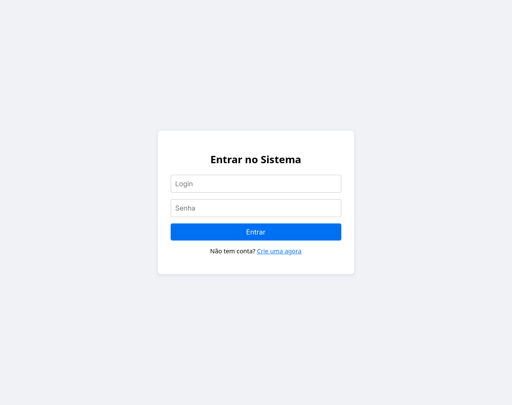
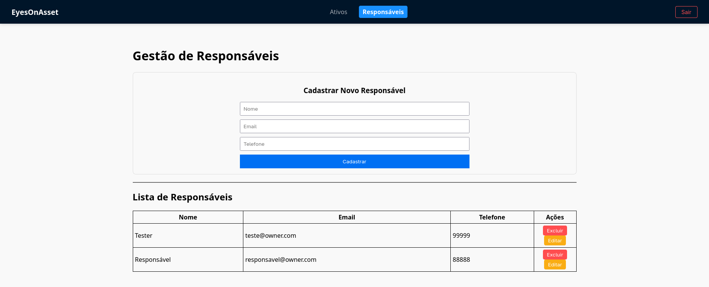
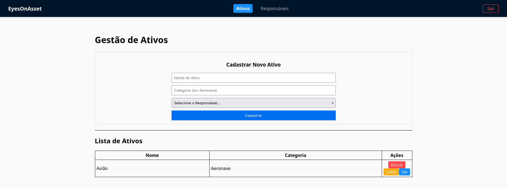

# 👁️ EyesOnAsset — Desafio Técnico Full-Stack

<p align="center">
  
</p>

## ✨ Sumário

* [Visão Geral e Contexto do Problema](#-visão-geral-e-contexto-do-problema)
* [🛠️ Tecnologias Utilizadas](#️-tecnologias-utilizadas)
* [✅ Escopo Entregue (Níveis Concluídos)](#-escopo-entregue-níveis-concluídos)
* [📦 Estruturas de Dados](#-estruturas-de-dados)
* [🚀 Setup e Instalação](#-setup-e-instalação)
* [🧪 Executando os Testes](#-executando-os-testes)
* [⚙️ Endpoints da API (FastAPI)](#️-endpoints-da-api-fastapi)
* [Entrega Final](#entrega-final)

---

## 💡 Visão Geral e Contexto do Problema

Este projeto implementa uma mini-versão simplificada do fluxo central da plataforma **EyesOnAsset**, plataforma de gestão inteligente de ativos.

O objetivo foi criar APIs e uma interface que permitam o **registro e a gestão automatizada de Ativos Físicos e seus Responsáveis**. O desenvolvimento foi realizado de forma incremental, com commits detalhados para cada nível de complexidade.

### Estrutura do Projeto
O projeto está dividido em duas pastas principais:
* `backend/`: Contém a API em Python/FastAPI.
* `frontend/`: Contém a interface em React.

---

## 🛠️ Tecnologias Utilizadas

### 💾 Back-end (Python/FastAPI)
| Categoria | Tecnologia | Justificativa/Uso |
| :--- | :--- | :--- |
| **Framework** | FastAPI | Criação da API de alto desempenho. |
| **Persistência** | SQLAlchemy + SQLite | ORM e banco de dados local para persistência de Ativos e Responsáveis. |
| **Autenticação** | JWT (python-jose) + Bcrypt (passlib) | Geração de tokens e hashing seguro de senhas. |
| **Testes** | Pytest + pytest-cov | Testes unitários e verificação de cobertura. |

### 🖥️ Front-end (React)
| Categoria | Tecnologia | Justificativa/Uso |
| :--- | :--- | :--- |
| **Framework** | Next.js | Construção da interface de usuário. |
| **Comunicação** | Axios | Biblioteca para comunicação com a API. |

---

## ✅ Escopo Entregue (Níveis Concluídos)

### 💾 Back-end

| Nível | Funcionalidade Principal | Status | Detalhes |
| :--- | :--- | :--- | :--- |
| **1** | Validação | ✅ Concluído | Criação da rota `POST /integrations/asset` com validações rigorosas (UUIDs, limites de string, campos obrigatórios). |
| **2** | Persistência | ✅ Concluído | CRUD completo para Ativo e Responsável com SQLAlchemy/SQLite. IDs são gerados automaticamente. |
| **3** | Testes | ✅ Cobertura de **85%** | Testes unitários para validação e persistência usando Pytest. |
| **4** | Autenticação JWT | ✅ Concluído | Rota `/integrations/auth` que gera JWT (expiração de 1 min). Todas as rotas protegidas. |
| **5** | Usuários | ✅ Concluído | Entidade 'Usuários' criada. Login refatorado para validar credenciais via banco de dados. |

### 🖥️ Front-end

| Nível | Funcionalidade Principal | Status | Detalhes |
| :--- | :--- | :--- | :--- |
| **1** | Telas Básicas | ✅ Concluído | Telas de Cadastro e Listagem para Ativos e Responsáveis com validação básica (dados iniciais mockados). |
| **2** | Conexão API | ✅ Concluído | Listagens (`GET`) e Cadastros (`POST`) conectados ao Back-end via Axios. |
| **3** | UX e CRUD Completo | ✅ Concluído | Páginas de Detalhes, Edição e Exclusão. Detalhe de Ativo exibe o nome do Responsável. Confirmação em ações destrutivas. |
| **4** | Autenticação UI | ✅ Concluído | Tela de Login. Token salvo no `localStorage`. Redirecionamento para Login em caso de expiração. |

## 🚀 Setup e Instalação

### 1. Requisitos
* **Back-end:** Python 3.10+, pip
* **Front-end:** Node.js, npm

### 2. Dependências Necessárias

#### Back-end (`requirements.txt` implícito)
```text
fastapi, uvicorn[standard], SQLAlchemy, pydantic[email], uuid,
pytest, pytest-cov, httpx, python-jose[cryptography], passlib[bcrypt]
```

### Front-end (`package.json` - exemplo de libs)
```text
react, react-dom, axios, next, typescript, tailwindcss, node, postcss, eslint
```

### 3. Execução Local

#### Setup do Back-end
```bash
cd backend/
python -m venv venv
source venv/bin/activate
pip install -r requirements.txt 
uvicorn app.main:app --reload
```

#### Setup do Frontend
```bash
cd frontend/
npm install
npm run dev
```

* Back-end Docs (Swagger UI): http://localhost:8000/docs

* Front-end App: http://localhost:3000

## 🧪 Executando os Testes

### 💾 Back-end (Pytest)

```bash
pytest --cov-report=term-missing
```

## ⚙️ Endpoints da API (FastAPI)

Todos os endpoints CRUD são protegidos e exigem um JWT válido no Header:
 
```plaintext 
Authorization: Bearer <token>
```

### 🔑 Autenticação 

#### 1. Login (POST /integrations/auth)


### 🛠️ Ativos 

#### 1. Criação (POST /integrations/asset)
#### 2. Busca todos (GET /integrations/asset)
#### 3. Busca por ID (GET /integrations/asset/{asset_id})
#### 4. Atualizar (PUT /integrations/asset/{asset_id})
#### 5. Deletar (DELETE /integrations/asset/{asset_id})


### 👤 Responsáveis

#### 1. Criação (POST /integrations/owner)
#### 3. Busca todos (GET /integrations/owner)
#### 3. Busca por ID (GET /integrations/owner/{owner_id})
#### 4. Atualizar (PUT /integrations/owner/{owner_id})
#### 5. Deletar (DELETE /integrations/owner/{owner_id})


### 👨🏻‍💻 Usuário

#### 1. Criação (POST /integrations/user)
#### 2. Busca por ID (GET /integrations/user)
#### 3. Busca por ID (GET /integrations/user/{user_id})
#### 4. Deletar (DELETE /integrations/user/{user_id})

### Para informações mais detalhadas, inicie o backend e acesse a [documentação](http://127.0.0.1:8000/docs#/)

## 📸 Previews da Interface

### Tela de Login
<p align="center">
  
</p>

### Tela dos Responsáveis
<p align="center">
  
</p>

### Tela dos Ativos
<p align="center">
  
</p>